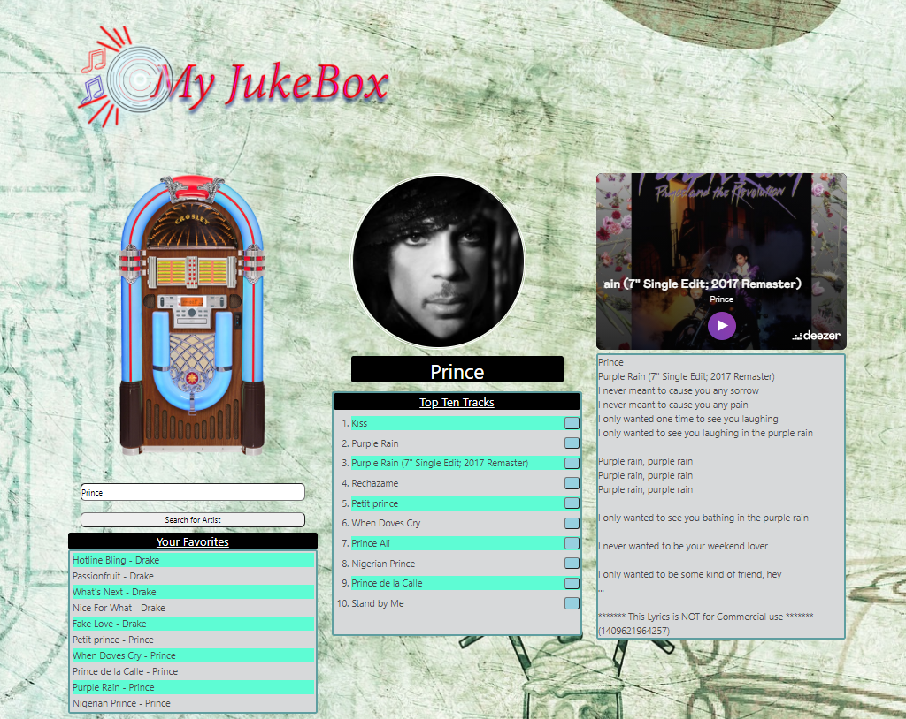

# My JukeBox

 ## THIS IS A GROUP PROJECT FOR THE UNIVERSITY OF ARIZONA CODING BOOTCAMP.
    
    USER STORY: 
    User wants to search a musician.
    The searched musicians top 10 songs will be presented.
    Then the user can select one of the songs to either be played or stored to thier favorites section.
    When the user clicks on the song, it will play a portion of the song to the user.
    Also when choosen song is played, a portion of the lryics will be presented to the user.  
    
## Contributors
The three collaborators are Alan Moreno, Robert Fuke and Austin Alderete.

## Description
In this project we used implimented bulma as a css framework into the HTML5 compiled with with javaScript.
We used two api's in this project.
Deezer is the api we used for the artist search along with the player for the selected song.
Musixmatch is the other api we used for the lyrics. 
The user will enter the name of the desired artist into the search box below the JukeBox.
When the user is finished with the input of the artist, they will press the button next to the input box to bring up the top ten songs of the users deised artist.
The user can then click the button to the left of the songs title and it will be added to thier favorites list.
The user will click the song to play a thirty second audio clip, additionally a prtion of the songs lyrics will be presented.

## Project challanges
* Use a css framework other than boostrap.
* Be deployed to GitHub Pages.
* Use client-side storage to store persistent data.
* Be interactive (i.e., accept and respond to user input).
* Use at least two server-side APIs.
* Does not use alerts, confirms, or prompts (use modals).
* Be responsive.
* Have a polished UI.
* Have a clean repository that meets quality coding standards (file structure, naming conventions, follows best practices for class/id naming conventions, indentation, quality comments, etc.).
* Have a quality README (with unique name, description, technologies used, screenshot, and link to deployed application).

## Project screen shots

## Project web link
click [here](https://algmoreno.github.io/arm/) to view the deployed site

